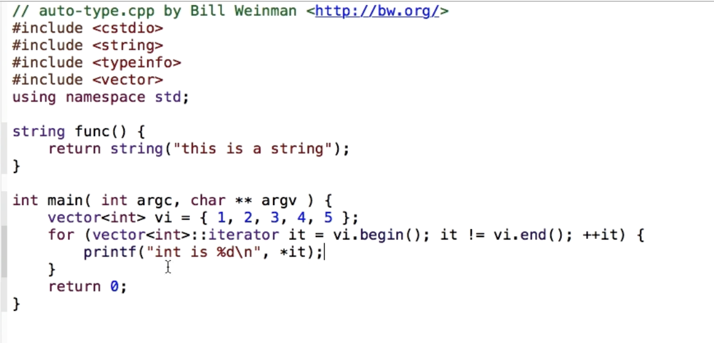
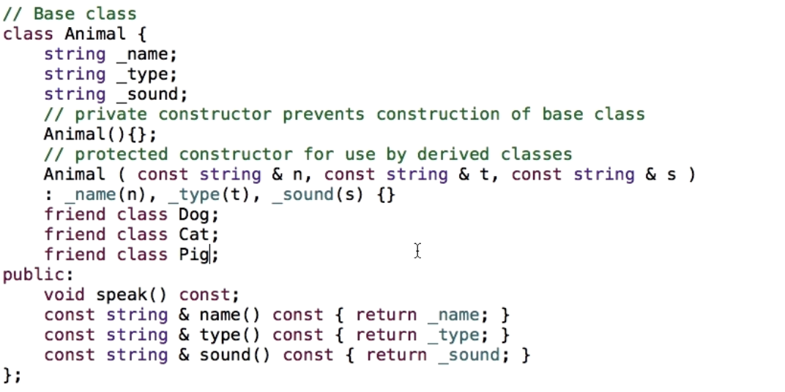
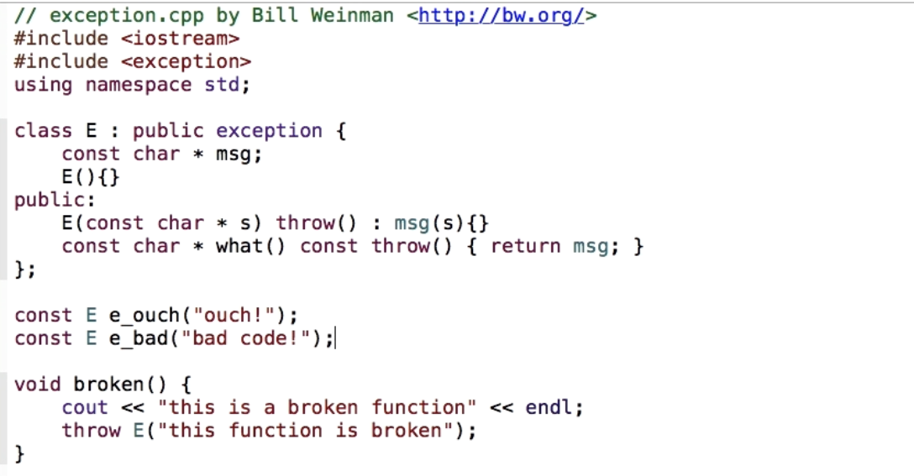

# C++ essential training
- [C++ essential training](#c-essential-training)
  - [Introduction](#introduction)
    - [What is C++?](#what-is-c)
    - [What incorporated in C++?](#what-incorporated-in-c)
    - [To learn](#to-learn)
  - [Basic syntax](#basic-syntax)
    - [Anatomy of C++ program](#anatomy-of-c-program)
    - [Statements and expressions](#statements-and-expressions)
    - [Identifiers](#identifiers)
    - [Defining Variables](#defining-variables)
    - [Pointers](#pointers)
    - [References](#references)
    - [Arrays and strings](#arrays-and-strings)
    - [Conditionals](#conditionals)
    - [Branching conditional](#branching-conditional)
    - [Looping](#looping)
    - [Using stdout](#using-stdout)
  - [Defining functions](#defining-functions)
    - [Overview of functions](#overview-of-functions)
    - [Using automatic and static variables](#using-automatic-and-static-variables)
    - [Returning values from a function](#returning-values-from-a-function)
    - [Using function pointers](#using-function-pointers)
    - [Overloading function names](#overloading-function-names)
    - [Overloading operators with functions](#overloading-operators-with-functions)
    - [Defining a variable number of arguments](#defining-a-variable-number-of-arguments)
    - [Recursion](#recursion)
  - [Preprocessor](#preprocessor)
    - [Using macros as constants](#using-macros-as-constants)
    - [Including files](#including-files)
    - [Conditional Compilation](#conditional-compilation)
    - [Parameterized macros](#parameterized-macros)
    - [Macro caveats](#macro-caveats)
    - [Line continuation with backslash](#line-continuation-with-backslash)
    - [Including files only once](#including-files-only-once)
  - [Classes and Objects](#classes-and-objects)
    - [Constructors and destructors](#constructors-and-destructors)
    - [Implicit vs explicit contructors](#implicit-vs-explicit-contructors)
    - [Using Namespaces](#using-namespaces)
    - [Pointing to the current object with _this](#pointing-to-the-current-object-with-_this)
    - [Overloading operators with member functions](#overloading-operators-with-member-functions)
    - [Overloading operators with non-member functions](#overloading-operators-with-non-member-functions)
    - [Conversion operators](#conversion-operators)
    - [New and Delete](#new-and-delete)
    - [Exceptions](#exceptions)
    - [Function objects](#function-objects)
  - [Data types](#data-types)
    - [Interger types](#interger-types)
    - [Floating point types](#floating-point-types)
    - [Characters and string](#characters-and-string)
    - [Escape sequences](#escape-sequences)
    - [Qualifiers](#qualifiers)
    - [References](#references-1)
    - [Structs](#structs)
    - [Bit fields](#bit-fields)
    - [Enumerations](#enumerations)
    - [Unions](#unions)
    - [Typedefs](#typedefs)
    - [Void](#void)
    - [Auto](#auto)
    - [Nullpointer](#nullpointer)
  - [Operators](#operators)
    - [Compound operators](#compound-operators)
    - [Unary increment and decrement operators](#unary-increment-and-decrement-operators)
    - [Logical operators](#logical-operators)
    - [Bitwise operators](#bitwise-operators)
    - [Ternary operators](#ternary-operators)
    - [Sizeof](#sizeof)
    - [Type of an object with typeid](#type-of-an-object-with-typeid)
    - [Operator precedence](#operator-precedence)
  - [Object inheritance](#object-inheritance)
    - [Overview](#overview)
    - [Friend class](#friend-class)
    - [Polymorphism and overloading](#polymorphism-and-overloading)
  - [Templates](#templates)
    - [Decltype in templates](#decltype-in-templates)
  - [C++ standard libary](#c-standard-libary)
    - [File I/O](#file-io)
    - [Formatted characters](#formatted-characters)
    - [String functions](#string-functions)
    - [Handling system errors](#handling-system-errors)
    - [Time](#time)
  - [Standard template library](#standard-template-library)
    - [iosstream manipulators](#iosstream-manipulators)
    - [Iterators](#iterators)
    - [List](#list)
    - [Pairs](#pairs)
    - [Sets](#sets)
    - [Maps](#maps)
    - [Stacks and queues](#stacks-and-queues)
    - [Exceptions](#exceptions-1)
        
## Introduction
### What is C++?

* General-purpose programming language - developed by Bjarne Stroustrup (Danish computer scientist) in 1970
* Object-oriented
* Functional
* Procedural
* Generic

### What incorporated in C++?
* Preprocessor
* C language syntax
* Classes and objects
* C++ templates
* STL (standard template library)
  
### To learn
* Basics and syntax
* Classes and templates
* Standard Library
* STL

Note: All notes are corresponding to C++11 compiler.

## Basic syntax

### Anatomy of C++ program

```
#include <iostream>
```
This is a preprocessor derivative to include the header file. 

```
using namespace std
```
To look for function in the std namespace if not found in current file.

```
int main (int argc, char ** argv){
    printf("Hello, Sumit!");
    return 0;
}
```
Main function required to execute the cpp program. Usually returns 0 for success, and 1 or other integers for failures.

Note: `printf`, `puts` are faster and simple than `cout`. 

### Statements and expressions

* Statements ends with `;`, which means a single statements could be layed over multiple lines unless terminated with `;`.
* An expression is anything that returns an value whether that value is used or not. Expression can be a part of the statement or entire statement.

```
int x;
x = 43;
printf("x is %d\n", x);
```
Here, `x=43`, is an expression assinging 43 to x, while in printf statement, `x` is again used as an expression (part of the statement) to return the value 43.

### Identifiers

Identifiers are that provide readable names for functions, variables, etc.
* ISO Latin alphabet (upper and lower case)
* Western Arabic numerals
* ASCII underscore

The identifier may not begin with a numeral. They may not conflict with reserved words as shown in below image. 

<p align="center">
  
</p>
<p align="center">
  
</p>


C++14 reserves 73 keywords and 11 alternative tokens.

Identifiers are case-sensitive.
Az not equivalent to aZ.

Identifiers can be of any length but only first 63 characters are checked for uniqueness and only 31 characters are guaranteed for external identifiers. So in practice, keep identifiers under 31 characters.

Identifiers beginning with `_` are private and those beginning with  `__` ( two _ ) are for system level use only. For long-term maintenance and readability be consistent with the identifier style. 

<p align="center">
  
</p>

### Defining Variables
* Variables should be defined before they are used. 
* Initialize the variables while defining them. Undefined variables are dangerous thing.
* Qualifier/modifiers change the behavior of variables in various ways. It becomes  part of the type.
```
  const int i = 2;
```
Here, const is the qualifier of type int, making sure that the value of i cannot changed once initialized i.e read-only variable.

### Pointers

The very useful, common and dangerous datatype in C++. `*` is also called de-reference and `&` as reference operator. 
```
int *ip; // define a pointer 
ip = &x; // store the address of variable x in the pointer
y = *ip; // assignment of value stored by x to y
```

### References

```
int &y = x;
y = 45; // changes the value of x
```
Reference has to be initialized with some address.

### Arrays and strings

- An array is fixed size container for elements of common type.
- Index starts from 0.
  
```
int ia[5];
ia[0] = 1;
*ia = 1; //same as above
*ip = 2;
++ip;
*ip = 3;
*(++ip) = 4;  
```
New way of initialization in C++11.
```
int ia[5] = {1, 2, 3, 4. 5}; 
```

- String is an special case of array of characters stored contiguously and can be indexed using pointer as well.

```
char s[] = {'s', 't', 'r', 'i', 'n', 'g', 0 } // null terminated string
char s[] = "string";
```

```
char s[] = "string";
// Old C++
for (char *cp; *cp; ++cp){
  printf("char is %c\n", *cp);
}
// in C++11
for (char c: s){
  if (c==0) break;
  printf("char is %c\n", c);
}
```

### Conditionals
* If, else if, else
```
if () {

} 
else if (){

} 
else {

}
```
* Ternary operator
```
x > y ? x : y;    
```
### Branching conditional

Take proper care to use the correct type of constant.

```
switch(x){
  case constant:
    expression;
    break;
  
  case ...

  default:
    break;
}
```
### Looping
While loop
```
while (i < 5>){
  expression;
}
```
Do while loop
```
do {
  expression;
}while(i > 5);
```

For loop for iteration

```
for (int i = 0; i < 5; ++i){
  expression;
}

for (char * cp; *cp; ++cp){
  expression;
} // terminates when *cp points to zero
// in C++, zero is false while everthing is true

```

Range based for loop in C++11
```
int a[] = {1, 2, 3};

for (int i : a){
  statements;
}
```

### Using stdout

cout is a class in C++ that works very differntly from printf and puts.
```
#include <iostream>
using namespace std;

int main(int argc, char ** argv){
  cout << "Hello, World!" << 2 * 7 << endl;
  return 0;
}
```

Cout need a whole lot of STL library to compile as it overload the bitwise left shift operator. **It is recommended to use printf or puts to just print statements on console.**

## Defining functions

### Overview of functions
* All code in C++ happens inside functions. Functions are the basis of C++ and class methods.
* Function signatures differentiate functions in C++. 
  ```
    long volume (long a, long b, long c){
      return a*b*c;
    }
    double volume (double r, int h){
      return 3.1415 * r * r * h;
    }
  ```
* Two ways of calling a function - call by value and call by reference. In call by value a copy of argument is passed whereas the in call by reference, the address of the variable is passed. Call by reference is useful for passing large objects/values as parameters.

  ```
  // Explicit using pointers - used in C
  int a = 1;
  void f(int* p){
    ++(*p);
  }
  f(&a);
  ```
  ```
  // Implicit using references - more often used in C++
  int a = 1;
  void f(int & p){
    ++p;
  }
  f(a);
  ```

- Paranthesis of function call are called the function call operator.
- Function should be declared before it is called.
```
  void func(); // function declaration
  
  int main(){
    func();
  }
  // function definition
  void func(){

  }
```
- The common way of including function definitions is using header files.

- To prevent the function from modifying the variable passed by reference. This is the safe way calling by reference. 
```
// readonly variable - constant reference 
void func(const int & i){

}
```
- Passing large values to functions using call by value can cause stack to overflow, crash and create vulnerabilities in the program.

###  Using automatic and static variables

- automatic variable are default ones which are automatically stored in the function stack each time the function is invoked.
- static variables not stored on the stack and it's persistent for the life of the entire process.
- Used for storing large variables anything larger than a few scalar variables.

```
void func(){
  static int i = 2; // i will remain 24 for next function call
  i = 24;
}
```
### Returning values from a function
- return values are copied and returned on stack.
```
// to return as reference, it should be a static variable
const string & func(){
  static string s = "This is a static string";
  return s;
}  
int main (){
  printf("string is %s", func().c_str());
}
```

### Using function pointers

Pointers to function - useful in jump arrays or tables, CGI or web services.

```
void func(){
  puts("this is func()");
}

int main(){
  void (*fp)() = func;
  puts("this if main()");
  (*fp)(); // or fp();
  return 0;
}
```

### Overloading function names

 - Functions in C++ are distinguised not based on names but entire function signature.
- Functions in C are distinguished by names.
- Functions in C++ should not only be distinguised by return type.
  
```
double volume(double a){

}

double volume(double a, double b){

}
```

### Overloading operators with functions
- Operators such as +, -, etc can be used to overload to do operations on classes.
- It should be used with lot of caution (always makes sense), as it doesn't add any functionality which isn't there.
- In built operators cannot be overloaded,  for example + cannot be overloade to divide two integers.
    
### Defining a variable number of arguments

```
#include <cstdarg> // header for variadic variables

// first argument is total number of parameters to be averages and rest are the doubles for avg

double average (const int count, ...){
  va_list ap;
  int i;
  double total = 0.0;

  va_start(ap, count);
  for (i = 0; i< count; i++){
    total += va_arg(ap, double)
  }
  va_end(ap);
  return total/count;
}
```
### Recursion
Function calling itself
```
unsigned long int factorial(unsigned long int n){
  if (n < 2) return 1;
  return factorial (n - 1) * n;
}
```
- A recursive function can use a lot of resources. For each call, memory is allocated for parameters, local variables, return value, etc all on stack. Thus, a  possible stack overflow and creating a security vulnerability.
- Don't use recursion for large number of iterations.
- A safe and effective way of doing this is using loop.


## Preprocessor

Steps to convert source code to executable file.


- The job of the preprocessor is to process the source code before and prepare the source code for the compiler. There are several parts to the preprocessor's work. One of the common use is the file inclusion.
- The codes of include directive are included in the source file and the whole thing is treated as translation unit.
- Preprocessor macro works like a smart alias. Example - `#define ONE 1`.
- Conditional preprocessing allow to process the certain part of your code only if certain conditions are true.
      Example - include guard technique to prevent processing from more than once.
<p align="center">
  
</p>

- Pragmas can be used to control the implemention-specific behaviors for the compiler. Most common uses are supporting specific compilers and computing architectures.

### Using macros as constants
- They are not actually constant but act as a text replacement.
- They are defined using preprocessor directives, starting with #
  - Example - ONE is replaced by 1 in the entire source code before the compiler gets to it. 
  ```
  #define ONE 1  

  // Notice there is no semicolon, because this is not c++ language, it is preprocessor language.
  ```
- These constants are not variables and won't show up in the debugger or won't find their address or can't use a pointer to it.

### Including files
- It replaces the directives with the content of header file and that combined unit known as translation unit is passed to compiler.
- Two ways to include files - 1. `#include < ....h >`, 2. `#include"...h"`. Angle brackets are used for system level header files while double quotes are used for project level header files.

### Conditional Compilation
```
#if (if)
#ifdef (if defined)
#ifndef (if not defined)
#else (else)
#elif (else if)
#endif (end if)
#if defined (MACRO)
#if !defined (MACRO) same as #ifndef
```
Example - 
```
#ifdef FOO
#define NUMBER 47
#else
#define NUMBER 10
#endif
```
- Conditional compilation directives are commonly used for separate versions of code, for debug, or supporting different target environments.

### Parameterized macros
```
#define MAX(a,b) (a > b ? a : b)

int main(){
printf("value is %d", Max(3,5));
}
```
- C++ templates are recommended over parameterized macros

### Macro caveats
Macros not working as expected. In the below example increment function is evaluated more than expected number of times.
<p align="center">
  
</p>

### Line continuation with backslash
- Macros need to be defined in one line
- `\` character is used to break lines, for making complex code more readable i.e. used to define macros on multiple lines. But also works with C++ code.
<p align="center">
  
</p>

### Including files only once
- Common solution is include guard.
- Other common non-standard solution is using pragma, supported by most modern compilers but may be fooled by smybolic links.
```
// Inside the header file
#pragma once  
```

## Classes and Objects
* Classes are the custom data types, that allows to 
  * Create constructors
  * Allocate and deallocate memory
  * Overload operators
  * Create conversion operators

* Classes have two types of members. 1) Data members or properties 2) Methods or member functions. It is a common practise to separate the interface from the implementation which is done by declaring* The instance of class is known as object. By default, the data members of class are private but members of struct are public. If there are only data members use struct and if there are also function members then use classes. the function inside the class and define them outside the class, both implemented in different files. 
<p align="center">
  
</p>

* The instance of class is known as object. By default, the data members of class are private but members of struct are public. If there are only data members use struct and if there are also function members then use classes.
* Private members can be accessed and set by public functions of the classes.
* getter can either be defined as mutable or const safe or both. Private members cannot be changed inside the const safe methods.   
 <p align="center">
  
</p>

### Constructors and destructors
- Constructors are called when the object is instantiated and destructors when the objects are destroyed.
- The names of constructors are same as of the class.
- By default there are implicit constructors and destructors even if we do not define them in the class.
- To prevent the use of some constructors, they can be put in the private section of the class interface.

### Implicit vs explicit contructors
- Explicit constructors prevent the implicit conversions during instantiating the class.
<p align="center">
  
</p>

Implicit constructor example
<p align="center">
  
</p>

Explicit constructor example
<p align="center">
  
</p>

### Using Namespaces
- Allow to use classes and fucntions part of the namespace.
- Namespaces act as wrappers for the classes and methods. 

### Pointing to the current object with _this
using `this` in the class methods points to the object's address.
<p align="center">
  
</p>

### Overloading operators with member functions

<p align="center">
  
</p>

<p align="center">
  
</p>

### Overloading operators with non-member functions
In the previous example object + 14 will work with member overload due to implicit conversions. But the reverse 14 + object won't work because there need to object on the left hand side. Therefore, a non-member function is used to solve this problem.

<p align="center">
  
</p>

### Conversion operators

It allows to use your first class type and cast it into any other type.

### New and Delete

- New allocates the static memory for the object and return the address to the pointer.
- Delete removed the allocated space for the object.
- Using new for array objects require array version of delete.
  
<p align="center">
  
</pj>
<pj align="center">
  
</p>

### Exceptions

Error can be reported using exception class and using try and catch functionality.

<p align="center">
  
</p>

### Function objects

Use class objects like a function call.

<p align="center">
  
</p>

<p align="center">
  
</p>

## Data types
The fundamental data types include - 
- Integer types
- Floating point types
- Boolean type
Others include - 
- Array
- Classes
- Structures
- Union types
- Pointer types
- References types (immutable)

### Interger types
* char (could be unsigned or signed, 8 bits)
* short int (16 bits)
* int (32 bits)
* long int (32 or 64 bits)
* long long int (64 bits)
  Unsigned types are available with unsigned modifier.

Specific width integer types - important when using same code on different systems.
```
#include <cstdint>

Signed  | Unsigned  | 
--------|-----------|
int8_t  | uint8_t   |
int16_t | unit16_t  |
int32_t | unit32_t  |
nit64_t | unit64_t  |

```
```
long int x = 42L; // long
long int x = 42LL; // long long
long int x = 0223; // octal
long int x = oxff93; // hexadecimal
long int x = 0b10001; // c++14 only
```

### Floating point types
* float
* double
* long double

```
float f = 500;
float f = 5e2; //scientific
```
In most modern systems, float has a precision of 7 digits, and double 16 digits. There are rounding error assotiated with floating points.

### Characters and string
Fundamental strings are array of characters teminated by null character. 
```
char s[] = "string" "string1" "string2";
```
### Escape sequences


### Qualifiers
Modifies the properties of the variables.

<p align="center">
  
</p>
<p align="center">
  
</p>

### References
Be careful while using references. There could be some unintented side-effects.
Correct way of using references is shown below.

<p align="center">
  
</p>

### Structs
Same as classes but data members are public by default and do not have member functions.

<p align="center">
  
</p>

### Bit fields
Variable can be assigned how many bits they will take.

<p align="center">
  
</p>

### Enumerations

<p align="center">
  
</p>

### Unions
Allows to use same data space for different memory types. They save space in data structure for polymorphism. For more complex cases consider using a class.

<p align="center">
  
</p>

### Typedefs
Used for aliasing. When using typedef end the variable name using `var_t`.


<p align="center">
  
</p>

### Void
No value to be returned or required.
In C, `func (void)` means function does not require any argument, whereas `func ()` doesn't mean that function requires no argument. But in C++, `func()` is same as `func(void)`.

### Auto
Automatic determines the type of variable.

<p align="center">
  
</p>
<p align="center">
  
</p>
<p align="center">
  
</p>
<p align="center">
  
</p>

### Nullpointer
In C, we had to define macro for null pointer. But in C++, we have unambiguous null pointer defined.

<p align="center">
  
</p>

## Operators

### Compound operators
These are more efficient than there simple equivalent operators.
```
x = x + y; // two copy operations needed
x += y; // one copy operation needed
```

### Unary increment and decrement operators
The preefix (++x) operator increments and return the incremented value whereas the postfix (x++)  operator returns the non-incremented value and increments the value after returning.
**Note that prefix operator is more efficient than postfix operator. The postfix operator need two copy operations and a constructor and destructor operations which don't exit in prefix operator.**

### Logical operators

And `&&`, or `||`

### Bitwise operators
Used for performing bitwise operations on integer values.
- Left shift `<<`
- Right shift `>>`
    
### Ternary operators
Requires three operands, cannot be overloaded.
```
x > y ? "yes" : "no"
```

### Sizeof
Return the size of variables in bytes.
```
#include <cstdio>
int main(){
  int x = 2;
  prinf("size of x is %ld", sizeof x);
  prinf("size of x is %ld", sizeof(x));
  return 0;
}
```

### Type of an object with typeid

To determine the type of object.
<p align="left">
  
</p>

### Operator precedence
The order in which operators are evaluated. Use paranthesis to make clear the order you want to evaluate the expression.

<p align="left">
  
</p>

## Object inheritance

### Overview
The derived/child/sub class inherits data members and functions from the base/super/parent class. C++ provides complete support for overloading methods, polymorphism and multiple inheritance.

<p align="left">
  
</p>
<p align="left">
  
</p>
<p align="left">
  
</p>

### Friend class
Gives access to all private members and functions of base class to the derived class. Even outside functions can be declated as friend of the base class but it undermines capsulation. Most of the time it is best to access private members through class interface functions.

<p align="left">
  
</p>

### Polymorphism and overloading
Functions can be overloaded in the derived classes. However, to tell the compiler to prefer the derived method call, `virtual` qualifier can be used for function call and destructor.

<p align="left">
  
</p>

## Templates
- Support generic programming i.e. programming without specifying the type of methods or data members. They are widely used in standard template libraries. The generic nature of them makes a perfect fit for use with container classes. 
- They have to used with caution as they lead to larger executable files, confusing error messages making it challening to debug, longer compile times.

<p align="left">
  
</p>
<p align="left">
  
</p>

### Decltype in templates
decltype determines the type of data and then another variable can be instantiated with that data type.
`-->` is the trailing return which tell the return type to the compiler.

<p align="left">
  
</p>
<p align="left">
  
</p>
<p align="left">
  
</p>

## C++ standard libary

In c, `#include <stdio.h>` is used as header whereas in c++ `#include <cstdio>` is used. C standard libraries can also be used with c++ for common functionalities.

### File I/O

<p align="left">
  
</p>

- fputs, fgets can be used to read input and write output from a file or to console.
- To me more consistent with fgets, always use fflush which flushes the buffer which may not be done automatically in some system libraries.
- Do not ever use gets as it doesn't check buffer size and can easily cause buffer overflows and security concerns.

### Formatted characters
- printf, fprintf, snprintf, sprintf are commonly used to write the data on console, files and strings.
- Don't use sprintf as it dosen't check for buffer max length and can cause vulneribilites.
<p align="left">
  
</p>

### String functions
- An string is an array of characters terminated by 0. There is subtle difference between while defining string with char pointer as the compiler may complain if the const word not used.

<p align="left">
  
</p>

- strnlen : find the length of string with max buffer parameter.
- strcmp : compare two string and return zero, - or + values.
- strncat : jont two string with max buffer. 
- strncpy : copy the string to another string
- strchr : returns the first position of a character looked for.
- strrchr : returns the last position of character looked for.
- strstr : returns the first position of string withing another string or zero if not found.

These string function should be used whenever necessary and sometimes even faster than C template library.

### Handling system errors

<p align="left">
  
</p>

### Time
- `ctime` header
- time_t datatype which is a 64 bit to hold seconds in integer from 1st January 1970.
- `struct tm` layout is also used.

<p align="left">
  
</p>

## Standard template library
- It provides containers, iterators, algorithms etc and is part of every c++ development system. They have rich set of features and intuitive interface. For references and books visit [www.cpp.bw.org](www.cpp.bw.org).
- string, vector, list

### iosstream manipulators


<p align="left">
  
</p>
<p align="left">
  
</p>
<p align="left">
  
</p>

### Iterators
Not all containers supports iterators and not all containers support the same type of interators.

### List
- Fast and lean but do not support random access.

### Pairs
```
#include <utility>

pair<int, string> p = {5, "string hello"};
cout << p.first << p.second << endl;
```

### Sets
- Ordered list, no random access, unique values.
- A set of strings will be arranged in alphabetical order
- Duplicate values are allowed in multiset
    
### Maps
- Ordered sets with key, value pairs. Hashmap array.

### Stacks and queues
- Queues and stacks : they are contained adapter classes i.e adapts to assigned object.
- deque : double ended stack
  
### Exceptions
- STL provides effective and efficient of handling exceptions at runtime.

<p align="left">
  
</p>
<p align="left">
  
</p>